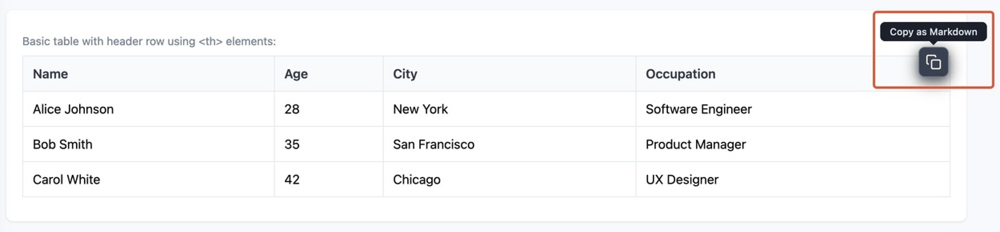

# HTML Table to Markdown - Chrome Extension

<div align="center">
  
  
  [](https://chrome.google.com/webstore/detail/mbjnhbnmmciknjjoojnkloipgejjogbd)
  [](https://www.producthunt.com/products/html-table-to-markdown-chrome-extension?launch=html-table-to-markdown-chrome-extension)
  [](https://opensource.org/licenses/MIT)
  [](http://makeapullrequest.com)
  
  <br/>
  
  <a href="https://www.producthunt.com/products/html-table-to-markdown-chrome-extension?embed=true&utm_source=badge-featured&utm_medium=badge&utm_source=badge-html&#0045;table&#0045;to&#0045;markdown&#0045;chrome&#0045;extension" target="_blank"></a>
</div>

## 🚀 Overview

**Table to Markdown** is a lightweight Chrome extension that converts HTML tables to Markdown format with a single click. Perfect for developers, technical writers, and anyone who works with Markdown documentation.

### ✨ Features

- 🔍 **Auto-detection** - Automatically detects all HTML tables on any webpage
- 🖱️ **Hover to reveal** - Shows a copy button when you hover over any table
- 📋 **One-click copy** - Instantly convert and copy tables to Markdown format
- 🎨 **Clean UI** - Minimal, non-intrusive design
- 🌓 **Dark mode support** - Adapts to your system's color scheme
- ⚡ **Lightning fast** - No external dependencies or API calls
- 🔒 **Privacy focused** - Works entirely offline, no data collection

## 📸 Screenshots

<div align="center">
  
  <p><em>Copy button appears when hovering over any HTML table</em></p>
</div>

## 📦 Installation

### From Chrome Web Store (Recommended)

1. Visit the [Chrome Web Store page](#) (coming soon)
2. Click "Add to Chrome"
3. Click "Add Extension" in the popup

### From Source (Developer Mode)

1. Clone this repository:

   ```bash
   git clone https://github.com/huahuayu/html-table-to-markdown.git
   ```

2. Open Chrome and navigate to `chrome://extensions/`

3. Enable "Developer mode" in the top right

4. Click "Load unpacked" and select the cloned directory

## 🎯 Usage

1. Navigate to any webpage with tables
2. Hover over a table
3. Click the copy button that appears
4. Paste the Markdown table anywhere!

## 🚀 Found it useful? Leave a review!

- ⭐ **Rating it 5 stars** on the [Chrome Web Store](https://chrome.google.com/webstore/detail/mbjnhbnmmciknjjoojnkloipgejjogbd)
- 🚀 **Upvoting on [Product Hunt](https://www.producthunt.com/products/html-table-to-markdown-chrome-extension?launch=html-table-to-markdown-chrome-extension)**

## 📄 License

This project is licensed under the MIT License
